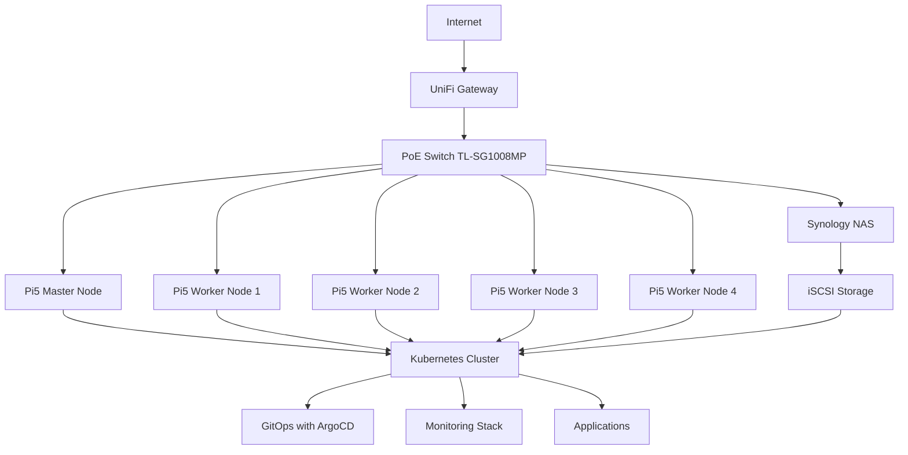

# Homelab Overview

This homelab is designed as a production-ready Kubernetes cluster built on Raspberry Pi hardware, providing a cost-effective platform for learning and experimentation with enterprise technologies.

## Architecture Overview

## Key Components

### Hardware Layer

- **5x Raspberry Pi 5**: 16GB RAM each with active cooling
- **PoE+ Switch**: Powers all Pi devices through single cable
- **NVMe SSDs**: 256GB storage per Pi for fast I/O
- **Synology NAS**: Network-attached storage for persistent data

### Network Layer

- **UniFi Gateway**: Enterprise-grade routing and firewall
- **Network Monitoring**: Real-time metrics collection
- **VLAN Segmentation**: Isolated network segments for security

### Kubernetes Layer

- **Control Plane**: Single master node with HA storage
- **Worker Nodes**: 4x worker nodes for application workloads
- **CNI**: Calico for network policy and connectivity
- **Storage**: Synology CSI for persistent volumes

### Application Layer

- **GitOps**: ArgoCD for declarative application management
- **Monitoring**: Prometheus, Grafana, and AlertManager
- **DNS**: Pi-hole for network-level ad blocking
- **Ingress**: NGINX Ingress Controller with TLS

## Design Principles

### High Availability

- Multi-node cluster design
- Persistent storage for critical data
- Network redundancy where possible
- Automated failover for applications

### Observability

- Comprehensive metrics collection
- Centralized logging (planned)
- Network performance monitoring
- Infrastructure health monitoring

### Security

- Network segmentation with VLANs
- Certificate management with cert-manager
- Secrets management with Kubernetes secrets
- Regular security updates

### Automation

- GitOps workflow for all deployments
- Automated certificate renewal
- Self-healing applications
- Infrastructure as code

## Benefits of This Setup

1. **Learning Platform**: Hands-on experience with enterprise technologies
2. **Cost Effective**: Professional setup without enterprise hardware costs
3. **Scalable**: Easy to add nodes or upgrade components
4. **Production-like**: Real-world technologies and practices
5. **Energy Efficient**: Low power consumption compared to traditional servers

## Use Cases

- **Development Environment**: Test applications in Kubernetes
- **Home Automation**: Self-hosted smart home applications
- **Network Services**: DNS, monitoring, and network tools
- **Learning Lab**: Experiment with new technologies safely
- **Backup Target**: Reliable storage for important data

## Performance Characteristics

- **Total RAM**: 80GB across cluster
- **Storage**: 1.28TB NVMe + NAS expansion
- **Network**: Gigabit Ethernet with PoE+
- **Power**: ~100W total consumption
- **Availability**: 99%+ uptime with proper maintenance

This architecture provides an excellent foundation for learning Kubernetes, cloud-native technologies, and modern infrastructure practices while maintaining reasonable costs and power consumption.
