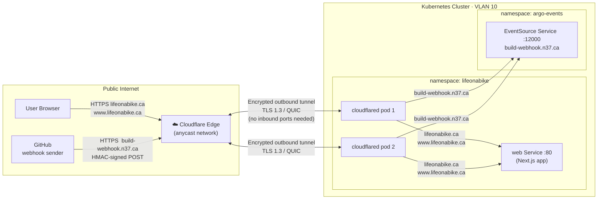

# Cloudflare Tunnel

Cloudflare Tunnel (`cloudflared`) provides secure public access to cluster services without opening any inbound firewall ports. The tunnel is established as an **outbound** connection from two `cloudflared` pods inside the cluster to Cloudflare's edge network.

## Architecture



### Key properties

| Property | Value |
|----------|-------|
| **Tunnel name** | `homelab-k8s` |
| **Tunnel UUID** | `c8c74986-4238-4558-9387-905cd91b409b` |
| **Image** | `cloudflare/cloudflared:2024.10.0` |
| **Replicas** | 2 (active-active, both connect to Cloudflare edge) |
| **Namespace** | `lifeonabike` |
| **Credentials** | SealedSecret `tunnel-credentials` → `credentials.json` |

### Ingress routing

| Public hostname | Internal service | Protocol |
|----------------|-----------------|---------|
| `lifeonabike.ca` | `web.lifeonabike.svc.cluster.local:80` | HTTP |
| `www.lifeonabike.ca` | `web.lifeonabike.svc.cluster.local:80` | HTTP |
| `build-webhook.n37.ca` | `lifeonabike-github-eventsource-svc.argo-events.svc.cluster.local:12000` | HTTP |
| *(catch-all)* | `http_status:404` | — |

---

## How-to: Creating the Tunnel from Scratch

This documents every command used to provision the tunnel. Follow this if recreating the tunnel after a Cloudflare account change or tunnel rotation.

### Prerequisites

- `cloudflared` CLI installed on your workstation
- Cloudflare account with the `n37.ca` and `lifeonabike.ca` zones
- `kubectl` access to the cluster
- `kubeseal` installed for sealing the credentials secret

### Step 1 — Install cloudflared

**macOS:**

```bash
brew install cloudflare/cloudflare/cloudflared
```

**Linux (ARM64 — e.g. on a Pi or WSL):**

```bash
curl -L -o cloudflared.deb \
  https://github.com/cloudflare/cloudflared/releases/latest/download/cloudflared-linux-arm64.deb
sudo dpkg -i cloudflared.deb
```

Verify:

```bash
cloudflared --version
```

### Step 2 — Authenticate to Cloudflare

```bash
cloudflared tunnel login
```

This opens a browser. Select your Cloudflare account and authorise the zones (`n37.ca`, `lifeonabike.ca`). A certificate is saved to `~/.cloudflared/cert.pem`.

### Step 3 — Create the tunnel

```bash
cloudflared tunnel create homelab-k8s
```

Output includes the **Tunnel UUID** — save this. The credentials JSON is written to:

```
~/.cloudflared/<UUID>.json
```

Verify the tunnel exists:

```bash
cloudflared tunnel list
```

### Step 4 — Create DNS routes

Each hostname you want to serve through the tunnel needs a CNAME in Cloudflare DNS pointing to `<UUID>.cfargotunnel.com`. The `route dns` command creates these automatically:

```bash
cloudflared tunnel route dns homelab-k8s lifeonabike.ca
cloudflared tunnel route dns homelab-k8s www.lifeonabike.ca
cloudflared tunnel route dns homelab-k8s build-webhook.n37.ca
```

Verify:

```bash
cloudflared tunnel info homelab-k8s
```

### Step 5 — Create the Kubernetes Secret

The credentials JSON must be available to the `cloudflared` pods as a Kubernetes Secret.

```bash
# Replace <UUID> with your actual tunnel UUID
TUNNEL_UUID="c8c74986-4238-4558-9387-905cd91b409b"

kubectl create secret generic tunnel-credentials \
  --from-file=credentials.json="${HOME}/.cloudflared/${TUNNEL_UUID}.json" \
  --namespace lifeonabike \
  --dry-run=client -o yaml > /tmp/tunnel-credentials-secret.yaml
```

### Step 6 — Seal the Secret

```bash
kubeseal \
  --cert <(kubectl get secret -n kube-system \
    -l sealedsecrets.bitnami.com/sealed-secrets-key=active \
    -o jsonpath='{.items[0].data.tls\.crt}' | base64 -d) \
  --format yaml \
  < /tmp/tunnel-credentials-secret.yaml \
  > manifests/base/lifeonabike/tunnel-credentials-sealed.yaml
```

:::caution Naming convention
The file must be named `*-sealed.yaml` (not `*secret*.yaml`). The `.gitattributes` rule encrypts any file matching `*secret*` with git-crypt, which breaks the SealedSecret (already encrypted) and yamllint.
:::

Clean up the plaintext file:

```bash
rm /tmp/tunnel-credentials-secret.yaml
```

### Step 7 — Commit and apply

The ConfigMap (tunnel config) and Deployment are already tracked in Git at:

```
manifests/base/lifeonabike/cloudflared.yaml
```

Commit the new SealedSecret, open a PR, merge, and ArgoCD will deploy it automatically.

If you need to apply immediately without waiting for ArgoCD:

```bash
kubectl apply -f manifests/base/lifeonabike/cloudflared.yaml
kubectl apply -f manifests/base/lifeonabike/tunnel-credentials-sealed.yaml
```

---

## Kubernetes Manifests

### ConfigMap — tunnel routing config

**File:** `manifests/base/lifeonabike/cloudflared.yaml`

```yaml
apiVersion: v1
kind: ConfigMap
metadata:
  name: cloudflared-config
  namespace: lifeonabike
data:
  config.yaml: |
    tunnel: c8c74986-4238-4558-9387-905cd91b409b
    credentials-file: /etc/cloudflared/creds/credentials.json
    no-autoupdate: true
    ingress:
      - hostname: lifeonabike.ca
        service: http://web.lifeonabike.svc.cluster.local:80
      - hostname: www.lifeonabike.ca
        service: http://web.lifeonabike.svc.cluster.local:80
      - hostname: build-webhook.n37.ca
        service: http://lifeonabike-github-eventsource-svc.argo-events.svc.cluster.local:12000
      - service: http_status:404
```

### Deployment

```yaml
apiVersion: apps/v1
kind: Deployment
metadata:
  name: cloudflared
  namespace: lifeonabike
spec:
  replicas: 2
  template:
    spec:
      containers:
        - name: cloudflared
          image: cloudflare/cloudflared:2024.10.0
          args: ["tunnel", "--config", "/etc/cloudflared/config/config.yaml", "run"]
          resources:
            requests:
              cpu: 10m
              memory: 24Mi
            limits:
              cpu: 100m
              memory: 64Mi
          volumeMounts:
            - name: config
              mountPath: /etc/cloudflared/config
              readOnly: true
            - name: creds
              mountPath: /etc/cloudflared/creds
              readOnly: true
      volumes:
        - name: config
          configMap:
            name: cloudflared-config
        - name: creds
          secret:
            secretName: tunnel-credentials
```

---

## Troubleshooting

### Tunnel not connecting

```bash
kubectl logs -n lifeonabike -l app=cloudflared --tail=50
```

Look for `"Connection established"` lines — each pod should show 4 connections to different Cloudflare PoPs.

### Hostname returns 502 / service unreachable

Verify the internal service is running:

```bash
kubectl get svc -n lifeonabike web
kubectl get svc -n argo-events lifeonabike-github-eventsource-svc
```

Check the ConfigMap ingress routing rules match the actual service names and ports.

### Credentials invalid / tunnel auth error

The tunnel credentials JSON has expired or was invalidated. Re-run from Step 3 (`cloudflared tunnel create` with a new name, or delete and recreate the existing tunnel via the Cloudflare dashboard), then re-seal and apply the new secret.

### Check tunnel status from Cloudflare dashboard

Navigate to **Zero Trust → Networks → Tunnels** in the Cloudflare dashboard. The `homelab-k8s` tunnel should show **Healthy** with the number of active connections matching the replica count (2).

---

**Last Updated:** 2026-06-01
