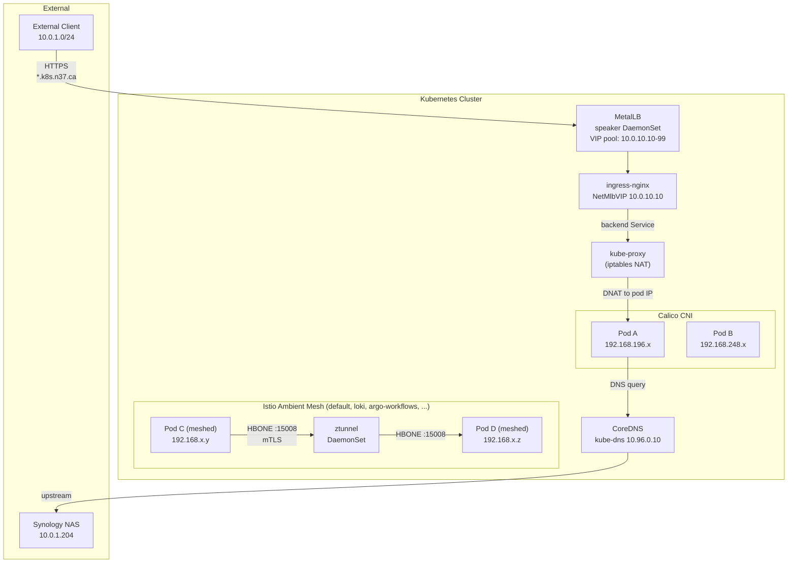
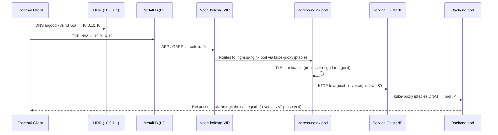
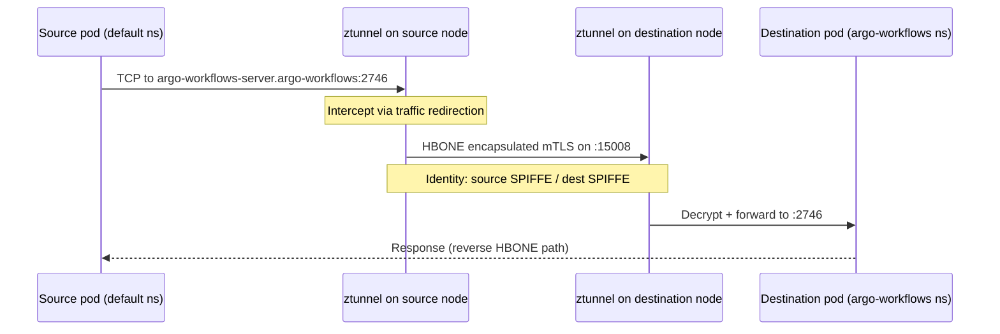
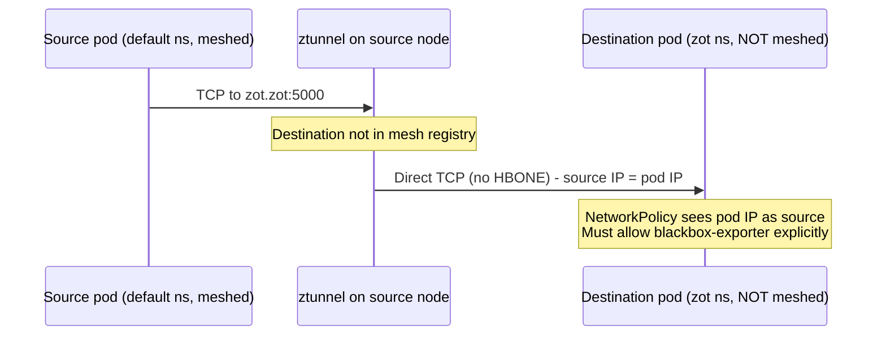
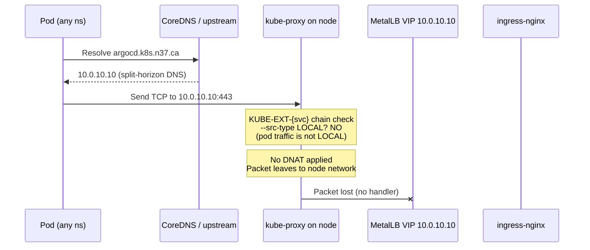
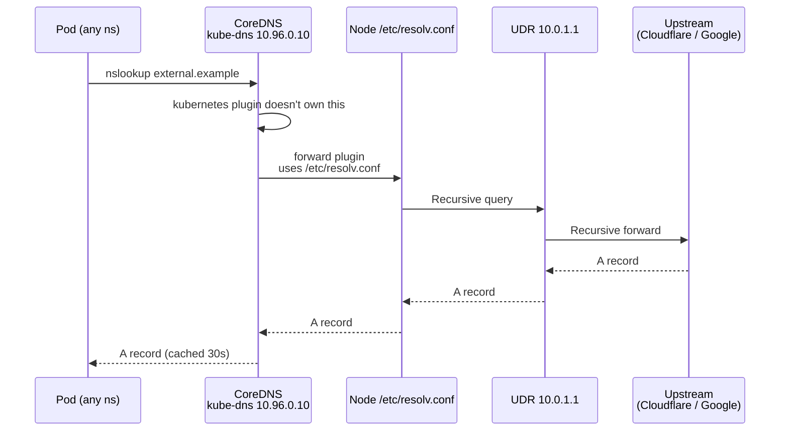

# Cluster Network Topology

The [Network Overview](./overview.md) doc covers the L1/L2/L3 view from the UDR down to nodes. This doc covers the **L4/L7 view inside the cluster** — packet flow for the four most-common paths.

## High-level inside-the-cluster

## Path 1 — External client → backend service

**Key details:**

- MetalLB runs in L2 mode (chart 0.16.1 with `frrk8s.enabled: false`). One node at a time owns each VIP via gratuitous ARP. Failover takes ~10 seconds.
- ingress-nginx is the only L7 router. For services with `nginx.ingress.kubernetes.io/auth-url` (oauth2-proxy), nginx does the auth subrequest before forwarding.
- ArgoCD's ingress is **TLS passthrough**, so ingress-nginx forwards the encrypted bytes and argocd-server terminates TLS itself. Grafana's ingress terminates TLS at nginx and forwards HTTP.

## Path 2 — Pod-to-pod (Istio Ambient HBONE)

When both source and destination namespaces have `istio.io/dataplane-mode=ambient`, traffic is automatically wrapped in HBONE (HTTP/2-over-mTLS on port 15008).

**Key details:**

- ztunnel runs as a DaemonSet (one per node).
- HBONE adds mTLS automatically — no application-side change.
- NetworkPolicies need a bare port 15008 ingress AND egress rule on every meshed namespace, plus link-local `169.254.7.127/32` for ztunnel health probes.

### What happens at the boundary

If the destination is **NOT** meshed (e.g. `default → zot`), ztunnel falls back to **direct TCP** with the source pod IP as the literal sender. The destination NetworkPolicy then needs to allow the source pod explicitly — the bare HBONE rule on port 15008 is irrelevant.

This is the gotcha that bit the SLO probe wiring in PRs #707 and #708 — see [Network Policies → Gotchas](../security/network-policies.md#hbone-bypass-requires-both-ends-ambient-meshed).

## Path 3 — Pod-to-MetalLB VIP (the hairpin)

Sometimes a workload resolves a service hostname like `argocd.k8s.n37.ca` and tries to reach the MetalLB VIP `10.0.10.10` from inside the cluster. This *mostly* doesn't work.

**Why this is broken.** kube-proxy installs a `KUBE-EXT-<svc>` iptables chain for every LoadBalancer Service. The chain only DNATs traffic where `--src-type` is `LOCAL` (= the node itself originated the packet). Pod traffic fails the LOCAL check, no DNAT happens, and the raw packet is routed to the node network where nothing answers.

**Workarounds:**

| Source pod type | Solution |
|---|---|
| Ambient-meshed pod, destination ingress backend is meshed | ztunnel HBONE bypasses kube-proxy — works |
| Ambient-meshed pod, destination is not meshed | Use ClusterIP DNS directly (`argocd-server.argocd:80`) |
| Non-meshed pod | Use ClusterIP DNS directly |

This is why Uptime Kuma monitors point at `http://argocd-server.argocd:80/healthz`, not `https://argocd.k8s.n37.ca/healthz`. And why SLO probes are split into an ingress-job (works for argocd/grafana) and a backend-job (works for everything via ClusterIP).

## Path 4 — Egress to upstream DNS / internet

**Pod-to-internet TCP**: once the pod has the IP, traffic egresses via the node's default route → UDR → WAN. Calico does **not** NAT in IPIP mode for cross-cluster pod-to-pod — but pod-to-external traffic IS source-NAT'd to the node IP by the kernel's MASQUERADE.

See [CoreDNS](./coredns.md) for resolver details and [Cloudflare Tunnel](./cloudflare-tunnel.md) for the reverse direction (inbound public traffic without a port-forward).

## Where NetworkPolicies apply

NetworkPolicies are evaluated by Calico at the source's egress AND the destination's ingress — **both** sides must allow the path. The most common failure modes:

1. **Source egress allows it, destination ingress doesn't** — destination NetPol's missing.
2. **Destination ingress allows it, source egress only allows certain ports** — common with the `default` namespace which restricts egress to a specific port list (80, 443, 8443, 161, plus a few service-specific entries).
3. **Both are correct but the path uses an intermediate hop** — e.g. an HTTPS probe to ingress-nginx → backend service. The probe pod's egress must reach ingress-nginx; ingress-nginx's egress must reach the backend.

See [Network Policies → Gotchas](../security/network-policies.md#gotchas) for the worked examples.

## Related

- **[Network Overview](./overview.md)** — VLAN topology, switch/router/AP layout, MetalLB pool allocation
- **[CoreDNS](./coredns.md)** — Corefile, resolution patterns, troubleshooting
- **[Cloudflare Tunnel](./cloudflare-tunnel.md)** — inbound public traffic without a port-forward
- **[Istio Ambient Mesh](../applications/istio.md)** — HBONE protocol, ztunnel internals
- **[MetalLB](../applications/metallb.md)** — L2 announcer config, VIP pool
- **[Network Policies](../security/network-policies.md)** — full policy reference and gotchas
