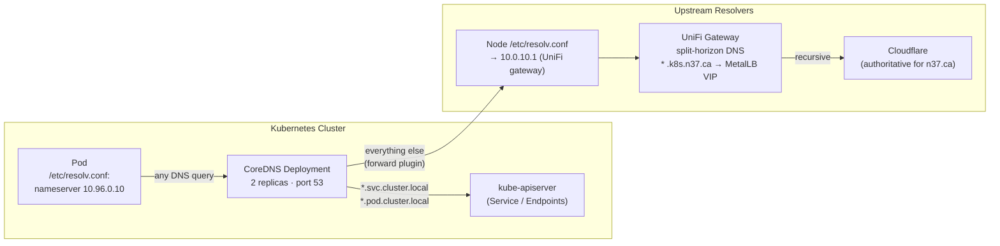

# CoreDNS

CoreDNS is the cluster DNS server. Every pod's `/etc/resolv.conf` points to the CoreDNS Service ClusterIP (`10.96.0.10`), and CoreDNS resolves `*.svc.cluster.local`, `*.pod.cluster.local`, and forwards everything else to the node's upstream resolvers.

## Architecture



## Deployment

| Property | Value |
|----------|-------|
| **Image** | `registry.k8s.io/coredns/coredns:v1.13.1` |
| **Namespace** | `kube-system` |
| **Replicas** | 2 (rolling update) |
| **Service** | `kube-dns` ClusterIP `10.96.0.10` (well-known) |
| **Metrics port** | `9153/metrics` (Prometheus format) |
| **Health port** | `8181/health` (Liveness/Readiness) |
| **CPU request / limit** | `100m` / unlimited |
| **Memory request / limit** | `70Mi` / `170Mi` |

CoreDNS is **not** managed by ArgoCD — it ships with `kubeadm` cluster bootstrap and lives in `kube-system`. Configuration is via the `coredns` ConfigMap.

## Configuration (Corefile)

The current Corefile is the upstream kubeadm default with one Pi-friendly tweak (cache disabled for `cluster.local`):

```corefile
.:53 {
    errors
    health {
       lameduck 5s
    }
    ready
    kubernetes cluster.local in-addr.arpa ip6.arpa {
       pods insecure
       fallthrough in-addr.arpa ip6.arpa
       ttl 30
    }
    prometheus :9153
    forward . /etc/resolv.conf {
       max_concurrent 1000
    }
    cache 30 {
       disable success cluster.local
       disable denial cluster.local
    }
    loop
    reload
    loadbalance
}
```

### Plugin-by-plugin

| Plugin | What it does in this cluster |
|--------|------------------------------|
| `errors` | Logs unhandled errors to stderr (visible in `kubectl logs`). |
| `health { lameduck 5s }` | `/health` endpoint on `:8080`. Lameduck gives the pod 5s to drain in-flight queries before terminating during a rolling update. |
| `ready` | `/ready` endpoint on `:8181`. Used by kubelet readiness probe — only routes traffic when all plugins have started. |
| `kubernetes cluster.local in-addr.arpa ip6.arpa` | The plugin that actually resolves Service and Pod records via the Kubernetes API. `pods insecure` means pod-IP DNS records are not verified against API auth (safe — no actual data exposed). `fallthrough` lets reverse DNS queries (`in-addr.arpa`/`ip6.arpa`) fall through to `forward` if Kubernetes doesn't own them. |
| `prometheus :9153` | Exposes `/metrics` for ServiceMonitor scraping (request count, duration, cache hit ratio, etc). |
| `forward . /etc/resolv.conf` | Any query CoreDNS can't answer goes to whatever's in the pod's `/etc/resolv.conf` (= the node's). `max_concurrent 1000` raises the limit from the default 1000 — irrelevant here, included by default. |
| `cache 30 { disable success cluster.local; disable denial cluster.local }` | 30-second cache for **everything except** `cluster.local`. The disables matter: in-cluster Service IPs change every time a pod gets a new IP, and we want resolution to see fresh state — no DNS-caused outages after a pod restart. Upstream queries DO cache (cuts traffic to UniFi gateway). |
| `loop` | Detects forwarding loops and crashes the pod on startup if one exists. Safety net — refuses to start if `/etc/resolv.conf` points back to itself. |
| `reload` | Watches the Corefile ConfigMap and reloads on change. ConfigMap edits take effect within ~30s without a pod restart. |
| `loadbalance` | Randomises round-robin records in responses. Matters for headless Services with multiple endpoints. |

## How resolution works

### Cluster service: `argocd-server.argocd.svc.cluster.local`

1. Pod sends UDP query to `10.96.0.10:53`.
2. CoreDNS recognises `cluster.local` → `kubernetes` plugin handles it.
3. Plugin queries the watched cache of K8s Services → returns the Service ClusterIP.
4. **Not cached** (per `disable success cluster.local`) — next query refetches.

### External domain: `cloudflare.com`

1. Pod sends UDP query to `10.96.0.10:53`.
2. No CoreDNS plugin owns `cloudflare.com` → falls to `forward`.
3. CoreDNS forwards to whatever's in `/etc/resolv.conf` (= node's upstream).
4. Node resolves via UniFi gateway → upstream public DNS.
5. **Cached 30s** in CoreDNS — repeated lookups hit cache.

### Public service through split-horizon: `argocd.k8s.n37.ca`

In this homelab, `*.k8s.n37.ca` records exist in **two** DNS zones:

- **External (Cloudflare)** — resolves to the public WAN IP (unused; no port-forward to the cluster).
- **Internal (UniFi gateway)** — resolves to MetalLB VIP `10.0.10.10`.

CoreDNS itself isn't doing the split — it forwards to the node's resolver, which is the UniFi gateway. The gateway returns the internal record. Result: in-cluster lookups of `argocd.k8s.n37.ca` resolve to `10.0.10.10` (MetalLB VIP).

:::warning Pod-to-MetalLB VIP hairpin
Resolving `argocd.k8s.n37.ca` to `10.0.10.10` from a pod is correct DNS-wise, but kube-proxy's `KUBE-EXT` chain only DNATs LoadBalancer VIPs when traffic source-type is `LOCAL` (node-originated). Pod traffic to the VIP silently drops. Non-meshed pods must use the ClusterIP service DNS (`argocd-server.argocd:80`) instead. Istio-meshed pods (ambient mode) work via ztunnel HBONE bypassing kube-proxy.
:::

## Monitoring

| Metric | Meaning |
|--------|---------|
| `coredns_dns_requests_total` | Per-server / per-zone / per-type query count. |
| `coredns_dns_responses_total` | Response count by rcode (NOERROR, NXDOMAIN, SERVFAIL). |
| `coredns_dns_request_duration_seconds` | Histogram of resolution latency. P99 above 100ms warrants investigation. |
| `coredns_cache_hits_total` | Cache hit count (per type: success/denial). |
| `coredns_cache_misses_total` | Cache miss count. |
| `coredns_panics_total` | Panic counter — should always be 0. |
| `coredns_forward_request_count_total` | Forwarded queries to upstream. High value = lots of external lookups. |

ServiceMonitor: the kube-prometheus-stack chart auto-deploys a ServiceMonitor for CoreDNS (label `k8s-app=kube-dns`). Verify:

```bash
kubectl get servicemonitor -n default kube-prometheus-stack-coredns
```

## Common queries

```bash
# Resolve a Service from inside the cluster
kubectl run -it --rm dns-test --image=busybox:1.36 --restart=Never -- \
  nslookup argocd-server.argocd.svc.cluster.local

# Check the current Corefile
kubectl get cm coredns -n kube-system -o jsonpath='{.data.Corefile}'

# Trigger a reload (after editing the ConfigMap, takes ~30s automatically)
kubectl rollout restart deployment/coredns -n kube-system

# Inspect CoreDNS metrics from outside its pod
kubectl port-forward -n kube-system svc/kube-dns 9153:9153
curl http://localhost:9153/metrics | grep coredns_dns_requests_total
```

## Troubleshooting

### Symptom: pod can't resolve any DNS

```
nslookup: write to '10.96.0.10': Connection refused
```

Likely causes:

- CoreDNS pods are crashlooping. Check `kubectl logs -n kube-system -l k8s-app=kube-dns`.
- NetworkPolicy is blocking egress from the pod's namespace to `kube-system:53`. Every namespace's NetworkPolicy must allow UDP/TCP egress to `kube-system` namespace on port 53. See `manifests/base/network-policies/<ns>/network-policy.yaml` in the homelab repo.

### Symptom: `cluster.local` resolves but `*.svc.cluster.local` doesn't

Caused by the `ndots:5` setting in pod `/etc/resolv.conf`. Single-label or short-label queries get search-domain expansion (`argocd-server` → `argocd-server.<ns>.svc.cluster.local`). If the search list is wrong, the lookup fails. Verify:

```bash
kubectl exec <pod> -- cat /etc/resolv.conf
# Should include: search <ns>.svc.cluster.local svc.cluster.local cluster.local
```

### Symptom: external lookups fail but cluster.local works

The `forward` plugin is the issue. Common causes:

- Node `/etc/resolv.conf` points to a stale resolver.
- UniFi gateway DNS is down.

Test the upstream directly from a node:

```bash
ssh imcbeth@10.0.10.214  # control-plane
nslookup cloudflare.com 10.0.10.1
```

### Symptom: stale Service IPs

Should not happen — the `disable success cluster.local` clause in the cache plugin specifically prevents this. If you see it, check the ConfigMap hasn't been mutated:

```bash
kubectl get cm coredns -n kube-system -o jsonpath='{.data.Corefile}' | grep -A 3 cache
```

### Symptom: high P99 query latency

Common causes:

- Upstream (UniFi gateway) is slow. Check `coredns_forward_request_duration_seconds` — if forward latency is high, the gateway is the bottleneck.
- CoreDNS is CPU-throttled. Inspect `container_cpu_cfs_throttled_seconds_total` for the CoreDNS pod.

## Related

- **[Cloudflare Tunnel](./cloudflare-tunnel.md)** — for public services that route via Cloudflare instead of MetalLB.
- **external-dns** — manages public DNS records (Cloudflare zone) and internal DNS records (UniFi webhook). Not a CoreDNS plugin; runs separately and updates upstream DNS providers based on Ingress hostnames.
- **Split-horizon DNS** — the UniFi gateway returns the **internal** MetalLB VIP for `*.k8s.n37.ca`; Cloudflare returns the public WAN IP. CoreDNS forwards via the node, which uses UniFi, so in-cluster lookups always hit the internal answer.
