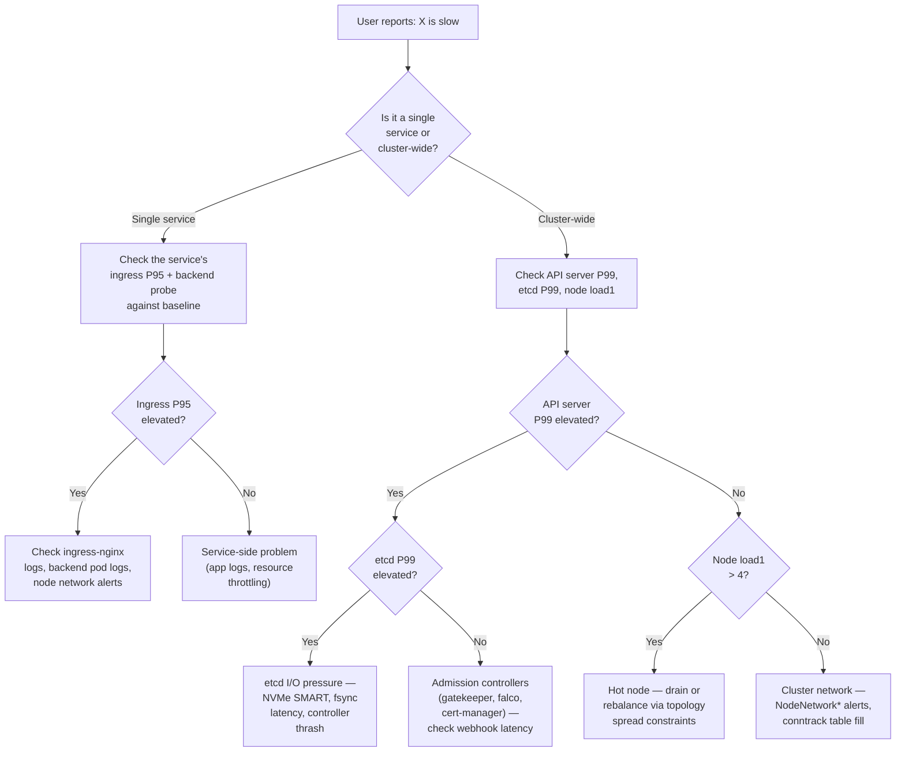

# Performance Baseline

The answer to "is the cluster slow today?" These numbers are the **steady-state** measurements you should compare against when investigating a perceived degradation. Anything more than ~3-5× a baseline value warrants investigation; anything within ~2× is normal variance for a Pi cluster on home networking.

Baselines captured 2026-06-03 at low-to-moderate load (38 ArgoCD apps, no active deploys, no Velero backup running). Refresh quarterly per the [capacity planning review](./capacity-planning.md#reviewing-the-plan).

## Control plane

| Metric | P99 baseline | Watch threshold | What it tells you |
|--------|-------------:|-----------------|-------------------|
| `apiserver_request_duration_seconds{verb=~"GET\|LIST"}` | **49 ms** | > 250 ms | Read-path latency. Spikes from heavy controllers (operators reconciling) or etcd pressure. |
| `apiserver_request_duration_seconds{verb=~"POST\|PUT\|PATCH\|DELETE"}` | **462 ms** | > 1.5 s | Write path. Higher than read because etcd write involves disk fsync. NVMe is fast but iSCSI etcd would be much worse — we run etcd local. |
| `etcd_request_duration_seconds` | **24 ms** | > 100 ms | etcd is the critical path. P99 above 100 ms = control plane slow + admission webhooks timing out cascade. |
| `coredns_dns_request_duration_seconds` | **36 ms** | > 200 ms | DNS latency. Mostly forward-plugin upstream waits (UniFi → Cloudflare). Cluster-local lookups are sub-ms. |

**Query reference:**

```promql
# Whatever percentile you want — change 0.99 to 0.50 or 0.95
histogram_quantile(0.99,
  sum by (le) (rate(apiserver_request_duration_seconds_bucket{verb=~"GET|LIST"}[5m]))
)
```

## Ingress (nginx)

P95 latency per ingress, baseline measurement under steady traffic:

| Ingress | P95 baseline | Notes |
|---------|-------------:|-------|
| `argocd-ingress` | **5 ms** | TLS-passthrough — nginx routes bytes, no L7 processing |
| `kube-prometheus-stack-grafana` | **9 ms** | TLS-termination + HTTP proxy |
| `argo-workflows-ingress` | NaN (no traffic) | Behind oauth2-proxy; latency only observed during active sessions |
| `zot`, `web` (lifeonabike), `localstack-ingress`, `falco-ui`, `oauth2-proxy`, `flink-demo` | NaN | Low or no traffic at baseline measurement time |

**Watch threshold:** P95 > 50 ms sustained for 15 minutes (warning), > 200 ms (critical).

```promql
# P95 by ingress
histogram_quantile(0.95,
  sum by (le, ingress) (
    rate(nginx_ingress_controller_request_duration_seconds_bucket[5m])
  )
)
```

## SLO probes (blackbox)

Average probe duration over a 5-minute window — measures end-to-end latency including DNS + TCP + TLS + HTTP for each target:

| Target | Path | Baseline | Notes |
|--------|------|---------:|-------|
| `https://argocd.k8s.n37.ca` | ingress | **16 ms** | TLS passthrough adds the TLS handshake to the probe |
| `https://grafana.k8s.n37.ca` | ingress | **38 ms** | TLS termination + HTTP forward, P99 ~50ms during active dashboards |
| `http://argo-workflows-server.argo-workflows:2746/` | backend | **8 ms** | HBONE-routed (ambient mesh on both ends) |
| `http://zot.zot:5000/v2/` | backend | **6 ms** | Direct TCP (zot not meshed); NetworkPolicy gated |
| `http://web.lifeonabike:80/` | backend | **5 ms** | Direct TCP, no NetPol on lifeonabike ns |

**Watch threshold:** any probe averaging > 5× baseline (e.g. argocd > 80 ms, grafana > 200 ms) over a 15-min window.

```promql
# Per-target probe duration baseline
avg by (instance) (probe_duration_seconds{slo_target!=""})
```

Probe failures (`probe_success=0`) are alerted via the [SLO burn-rate framework](../monitoring/slos.md).

## Node load

`node_load1` baseline range across the 5 Pi 5 nodes (4 cores each):

| Node count | Typical load1 | Saturation at |
|---------|---------------|---------------|
| 5 nodes (idle to moderate) | **0.6 - 2.2** | > 4.0 sustained (= queue depth > 1 per core) |

Pi 5 nodes show real load above 4.0; the kernel scheduler starts queuing and per-process latency rises. This is rare under our workload mix and usually correlates with a runaway controller or a Kaniko build.

```promql
# Per-node load1 right now
node_load1

# Per-node load1 normalized by core count
node_load1 / count by (instance) (node_cpu_seconds_total{mode="idle"})
```

## Container restarts

Steady-state baseline: **\<1 restart per pod per day** for normal workloads. Some controllers (external-dns-unifi) restart roughly daily due to upstream webhook idle-disconnects — these are benign as long as the count stays at 1/day, not 10/day.

| Restart count (24h) | Severity |
|-----------|----------|
| 0 | Healthy |
| 1 | Likely benign — long-lived process idle-disconnect, scheduled probe failure |
| 2-5 | Warrants investigation — check logs for crash patterns |
| > 5 | Action — CrashLoopBackOff alert already fires at 3 in 30m (`monitoring/grafana-dashboards` → "Cluster Health") |

```promql
# Top 10 pods by 24h restart count
topk(10,
  sum by (namespace, pod) (
    increase(kube_pod_container_status_restarts_total[24h])
  ) > 0
)
```

## Resource utilization

Cross-reference [Capacity Planning](./capacity-planning.md#current-baseline-2026-06-03) for the per-node CPU + memory snapshot. Steady-state baseline at the time of writing:

- CPU 13-32% across workers (idle headroom is large)
- Memory requests 24-34% per worker
- Memory limits 45-80% per worker — **node01 at 80% is the watchlist**

**Watch thresholds** are documented in [capacity planning's "When to add hardware"](./capacity-planning.md#when-to-add-hardware).

## Storage I/O

Baseline iSCSI latency from node-exporter `node_disk_*` metrics. The Synology DS925+ is on a 1 Gbit link, so saturation is bounded.

| Metric | Baseline | Watch threshold |
|--------|---------:|-----------------|
| `node_disk_read_time_seconds_total` rate | Sub-millisecond average | P99 > 50 ms |
| `node_disk_io_time_seconds_total` rate | < 100 ms/sec per device | > 700 ms/sec (= disk 70% busy) |

Synology dashboard (Grafana → "Synology NAS Overview") covers the NAS side (volume IOPS, RAID parity, SMART). Per-PVC latency is in "Storage Performance" dashboard via `kubelet_volume_stats_*` derived metrics.

```promql
# Per-node average disk read latency (5m)
rate(node_disk_read_time_seconds_total[5m]) /
rate(node_disk_reads_completed_total[5m])
```

## Prometheus itself

- **Active series**: ~206,000
- **Series growth**: track via `prometheus_tsdb_head_series` over 30 days. If it doubles, a noisy new exporter is likely the cause.
- **Query duration P99**: < 500 ms for ad-hoc dashboards; > 2 s = either a heavy query or Prometheus under load.
- **WAL truncation duration**: < 30 s.

```promql
# Series growth over 30 days
deriv(prometheus_tsdb_head_series[30d])

# Top 10 metrics by series count
topk(10, count by (__name__) ({__name__=~".+"}))
```

## Velero backups

Steady-state durations from `velero_backup_duration_seconds`:

- **daily-pvc-backup**: ~2-5 minutes (CSI snapshot — fast)
- **weekly-cluster-backup**: ~15-30 minutes (full resource backup + PVC snapshots)
- **DR validation CronWorkflow**: 3-4 minutes end-to-end

Schedule alerts (`velero_backup_last_successful_timestamp` age) catch missed backups via `VeleroBackupNotRunning` PrometheusRule.

## Image pull times

Routed through the [Zot registry](../applications/zot.md):

- **Cached pull (ARM64-filtered image)**: < 5 s
- **First pull (Zot pulls from upstream)**: 3-15 s for typical images
- **First pull (no ARM64 filter — pulls all platforms)**: > 40 s — see Zot doc gotcha
- **Pull from upstream Docker Hub (bypassing Zot)**: variable; rate-limited

If pod startup is sluggish across many pods at once, check whether the registry config is using `registry.k8s.n37.ca` for the path — flat path, no upstream prefix.

## Diagnostic flowchart — "this feels slow"



## How to refresh this baseline

1. Pick a steady-state moment (no active deploys, no backup window, no Renovate batch in flight).
2. Run the queries in each section above for P99 / P95 / averages.
3. Update the tables. Add a date stamp at the top.
4. If a baseline shifts >2× from the previous capture **without a known cause**, that's a finding — investigate before just updating the number.

## Related

- **[SLOs](../monitoring/slos.md)** — when latency degradation crosses a threshold worth alerting on
- **[Capacity Planning](./capacity-planning.md)** — when slowdown is caused by resource saturation
- **[Runbooks](./runbooks.md)** — recipes for the most common slow-cluster fixes
- **[Grafana Dashboards](../monitoring/grafana-dashboards.md)** — pre-built views of these metrics
