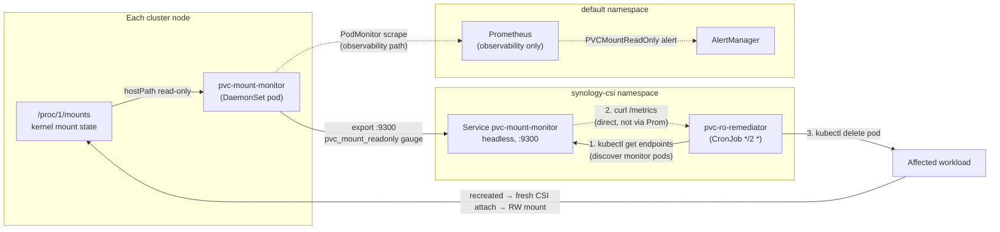

# PVC Read-Only Mount Auto-Remediation

The btrfs filesystem on iSCSI-backed PVCs occasionally remounts read-only after an iSCSI session interruption. Pods stay `Running` because liveness probes don't exercise the write path, so the breakage is invisible to standard health checks. Two cluster incidents (UDR factory reset 2026-04-19, planned cluster restart 2026-06-04) and one **16-day silent outage** (2026-06-21) motivated building dedicated detection + auto-remediation.

This page documents what was built, why each layer exists, and the architectural lessons that shaped it.

## TL;DR

**Pipeline:**

```
pvc-mount-monitor (DaemonSet)        reads /host/proc/1/mounts on every node
  → exports pvc_mount_readonly{node, pvc, ...} on :9300

pvc-ro-remediator (CronJob, */2m)    queries each monitor's /metrics directly
  → parses lines with `pvc_mount_readonly{...} 1`
  → maps mountpoint → pod UID → pod name via kubectl
  → kubectl delete pod (forces fresh iSCSI session + RW remount)
```

**Detection-to-recovery worst case: ~4 minutes.** Protected namespace allowlist prevents action on control-plane workloads. Health gauge is also scraped by Prometheus for alerting and dashboards.

## Why this exists — three incidents

### 2026-04-19: UDR factory reset

Synology iSCSI sessions dropped when the UDR rebooted. btrfs remounted the affected PVCs read-only. Loki, Prometheus, Grafana all silently failed writes for ~24h until someone noticed Grafana panels were empty. Manual recovery: `kubectl delete pod` for each affected workload.

### 2026-06-04: Planned cluster restart

Even with the documented clean-shutdown sequence (scale down stateful apps → wait for VA release → drain), two PVCs still remounted read-only on startup. Loki + Falco-Redis affected. Caught manually within a few hours.

### 2026-06-21: 16-day silent outage

This is the one that drove the whole automation strategy.

The auto-remediation pipeline had been verified working on 2026-06-07. The CronJob ran every 2 minutes, the alert rules were live, everything looked fine in ArgoCD. **For 16 days straight**, five workloads were crashlooping with EROFS errors — Loki, Uptime Kuma, Grafana, Falco-Redis, **and Prometheus itself**.

The remediator's hot path was:

```
remediator → curl http://prometheus:9090/api/v1/alerts
           → parse firing PVCMountReadOnly
           → kubectl delete pod
```

When **Prometheus's own PVC** went read-only, Prometheus crashed → the curl failed → the Job exited non-zero → `BackoffLimitExceeded` → the CronJob's `failedJobsHistoryLimit: 3` cleaned up the history within minutes. ArgoCD still reported the `synology-csi` app `Synced + Healthy` because the CronJob *resource* existed. There was no actionable signal anywhere.

**Lesson:** an auto-remediation system that depends on the system it's remediating is worse than no automation — people stop watching because "the automation has it covered."

## Architecture



The dotted lines are **observability only**. The remediation path is the solid line — it does not depend on Prometheus, AlertManager, or any alert evaluation.

## The detector — pvc-mount-monitor

### What it is

`DaemonSet` in the `synology-csi` namespace. One pod per node. Each pod runs a ~50-line Python HTTP server that:

1. Reads `/host/proc/1/mounts`
2. Filters lines matching `/var/lib/kubelet/pods/<UID>/volumes/kubernetes.io~csi/<PVC>/mount`
3. Sets gauge `pvc_mount_readonly{node, device, mountpoint, fstype, pvc} = 1` if the mount options contain `ro`, `0` otherwise
4. Serves the gauge as Prometheus text format on `:9300/metrics`

### Why /proc/1/mounts, not /proc/mounts

Initial deployment used `/host/proc/mounts`. Returned zero CSI mounts despite the cluster having 9 PVCs attached. Cause: `/proc/mounts` is a symlink to `/proc/self/mounts`, which resolves to the **calling process's** mount namespace — the container's, not the host's.

`/host/proc/1/mounts` references PID 1 (the host's init), bypassing the PID-namespace symlink resolution. PID 1 in `/host/proc` is always the host's init regardless of the container's PID namespace.

### Why hostPath, not hostPID

`hostPath: /proc` is read-only and gives access to the host's process namespace via PID 1 without sharing the entire host PID namespace into the container. Smaller blast radius if the container is compromised.

### Why an HTTP server, not a node-exporter textfile

node-exporter's `textfile` collector reads `*.prom` files from a directory. Writing those files on a `readOnlyRootFilesystem: true` container requires either an emptyDir or shared hostPath, both of which add coupling to node-exporter's deployment. A standalone HTTP server keeps the monitor self-contained. The HTTP path is also what the remediator queries directly (see below).

### Verifying the monitor

```bash
kubectl get pod -n synology-csi -l app.kubernetes.io/name=pvc-mount-monitor
# 5 pods, all 1/1 Running

# Sample one pod's /metrics
POD_IP=$(kubectl get pod -n synology-csi -l app.kubernetes.io/name=pvc-mount-monitor \
  -o jsonpath='{.items[0].status.podIP}')
kubectl run -n synology-csi --rm -i --restart=Never \
  --image=docker.io/alpine/k8s:1.36.2 --image-pull-policy=IfNotPresent \
  --overrides='{"spec":{"containers":[{"name":"x","image":"docker.io/alpine/k8s:1.36.2","command":["curl","-fsS","http://'$POD_IP':9300/metrics"],"resources":{"requests":{"cpu":"50m","memory":"64Mi"},"limits":{"cpu":"200m","memory":"128Mi"}}}]}}' \
  netcheck

# Sample output:
#   pvc_mount_readonly{node="node02",device="/dev/sda",mountpoint=".../pvc-e11.../mount",fstype="btrfs",pvc="pvc-e11..."} 0
```

## The remediator — pvc-ro-remediator

### What it is

`CronJob` in the `synology-csi` namespace, schedule `*/2 * * * *` (every 2 minutes). Each run:

1. `kubectl get endpoints -n synology-csi pvc-mount-monitor` to discover monitor pod IPs
2. For each IP: `curl http://<ip>:9300/metrics`
3. `grep '^pvc_mount_readonly{' | grep ' 1$' || true` for RO lines
4. For each RO line: parse the mountpoint to extract pod UID
5. `kubectl get pod -A -o json` and look up the pod with that UID
6. Refuse if pod is in a protected namespace (`kube-system|calico-system|tigera-operator|gatekeeper-system|metallb-system|istio-system|cert-manager|argocd`)
7. `kubectl delete pod --grace-period=30`

### Why query the monitors directly, not via Prometheus

**This is the most important design choice in the pipeline.**

The original design (2026-06-05) queried `http://prometheus.default:9090/api/v1/alerts` for firing `PVCMountReadOnly`. That hot path included Prometheus — the workload most likely to be RO'd, since it has the largest PVC. When Prometheus crashed, every CronJob run failed → silent no-op for 16 days.

The monitor-direct path (2026-06-21, PR #753) reaches the same data via a path that doesn't depend on the alerting stack:

| Layer | Original path (Prom-dependent) | Monitor-direct path |
|---|---|---|
| Source of truth | `/host/proc/1/mounts` | `/host/proc/1/mounts` |
| Aggregation | DaemonSet pods → Prom scrape → alert rule eval → alerts API | DaemonSet pods → direct curl |
| Dependencies | Prometheus + AlertManager + rule eval | K8s API + DNS + monitor pods |

Both have failure modes, but the failure modes for the direct path are detectable and distinct from "no work to do" — the script logs `ERROR: zero monitors reachable (of N endpoints)` if every monitor is unreachable, vs `no RO mounts detected (5/5 monitors reachable)` for the cluster-healthy case.

### Why a CronJob, not a Deployment with a wait loop

A CronJob restarts cleanly between runs, has built-in `concurrencyPolicy: Forbid`, and surfaces failures via standard Job status. A long-running Deployment with a sleep would mask script bugs (e.g. an uncaught exception that exits the wait loop without restarting). The 2-minute cadence is cheap (Job pod runs for ~1 second).

### Why a protected-namespace allowlist

`kubectl delete pod` on a workload in `kube-system` or `argocd` could cascade badly. The allowlist refuses action even if a monitor reports the mount RO. The downside: a control-plane RO mount won't auto-recover, but it's worth catching it manually rather than risking a cascade.

### Two layers of "this case looks like healthy"

The script went through two iterations where the cluster-healthy case looked like a script failure. Both are documented as gotchas at the bottom of this page:

- **`set -e` + `grep` no-match** — fixed in PR #764. The healthy state has zero RO mounts; `grep ' 1$'` exits 1 on no match; with `set -e` the script aborts before logging success.
- **NetworkPolicy intra-namespace egress** — fixed in PR #763. Same-namespace traffic is denied when the policy declares `Egress` without an explicit intra-ns allow rule. The remediator was getting `cannot reach monitor at <ip>:9300` for all 5 monitors despite both pods being in `synology-csi`.

Both bugs caused the script to fail-without-log in a way that looked identical to "no work to do" from outside.

## Verifying the pipeline

### Healthy state

```bash
JOB="pvc-ro-test-$(date +%s)"
kubectl create job -n synology-csi $JOB --from cronjob/pvc-ro-remediator

# Wait a few seconds, get the pod, view logs
POD=$(kubectl get pod -n synology-csi -l job-name=$JOB --no-headers | head -1 | awk '{print $1}')
kubectl logs -n synology-csi $POD

# Expected output:
# [<timestamp>] pvc-ro-remediator starting
#   monitor service: pvc-mount-monitor.synology-csi.svc.cluster.local:9300
#   dry-run: false
#   protected namespaces: kube-system|calico-system|...
# [<timestamp>] discovered 5 monitor endpoint(s)
# [<timestamp>] no RO mounts detected (5/5 monitors reachable)
```

If you see `no firing PVCMountReadOnly alerts` instead of `no RO mounts detected (5/5 monitors reachable)`, the deployed script is the **old** Prometheus-dependent version. Check that PR #753 + #764 are in main and the ConfigMap is updated.

### Simulating an RO mount

There's no clean way to simulate an EROFS remount without affecting a real workload. Instead, verify the **detection** side by:

1. Manually patching a `pvc_mount_readonly` series to 1 in the monitor's output (`kubectl exec` into a monitor pod and modify the script)
2. Or running the remediator with `DRY_RUN=true` set so it logs what it *would* delete

```bash
# Run with dry-run from manual job:
kubectl create -f - <<EOF
apiVersion: batch/v1
kind: Job
metadata:
  name: pvc-ro-dryrun
  namespace: synology-csi
spec:
  template:
    spec:
      serviceAccountName: pvc-ro-remediator
      restartPolicy: OnFailure
      containers:
      - name: remediator
        image: docker.io/alpine/k8s:1.36.2
        command: ["/bin/sh", "/scripts/remediate.sh"]
        env: [{name: DRY_RUN, value: "true"}]
        # ... (copy rest of CronJob template)
EOF
```

## Manual fallback — when the automation can't help

The automation handles the common case (one or two PVCs RO from a transient iSCSI blip). It can't help when:

- **The iSCSI globalmount itself is RO at the kernel level** (not just the pod's bind-mount). Pod-delete creates a fresh pod but it mounts the same RO device. Discovered 2026-06-21: 3 of 4 mounts on `node04` were RO at `/var/lib/kubelet/plugins/kubernetes.io/csi/.../globalmount`. Fix: `kubectl cordon` the node, delete the affected pods (forces reschedule to a different node where the CSI driver does a fresh attach), then `kubectl uncordon`.

- **A protected-namespace workload is affected.** Manual `kubectl delete pod -n <ns> <pod>` — no allowlist.

- **The monitor pods themselves are unreachable** (all 5 down, NetworkPolicy broken, etc.). The CronJob will log `ERROR: zero monitors reachable` and exit non-zero. ArgoCD will not surface this until the failure is repeated long enough — needs a dead-man-switch alert (open follow-up).

## Gotchas / lessons captured

These all bit us at least once. Captured here so the next "let's add another auto-remediation thing" PR has a checklist.

### 1. Don't make the remediator depend on the system being remediated

The 16-day silent outage existed because the remediator's hot path went through Prometheus, which was the first workload to fail. Solution: query the source of truth as directly as possible. The monitor pods' `/metrics` endpoint has no upstream dependencies.

### 2. `set -e` + `grep` is a trap

`grep` exits 1 on no match. The cluster-healthy state IS no match. Combined with `set -e`, the healthy case looks identical to a script failure. Always `|| true` the no-match path.

### 3. NetworkPolicy "both directions" applies to same-namespace traffic too

When a policy declares `policyTypes: [Egress]`, same-namespace pod-to-pod traffic is **denied** unless there's an explicit rule. The PVC RO automation series hit five separate NetPol gotchas before the remediator could reach the monitors:

| PR | What was missing |
|---|---|
| #736 | `synology-csi` ingress :9300 (Prom scrape into the namespace) |
| #738 | `default` egress :9300 (Prom out of the namespace) |
| #739 + #746 | `synology-csi` egress :9090 (remediator → Prom, deprecated) |
| #747 | `default` ingress :9090 from `synology-csi` (remediator → Prom, deprecated) |
| #763 | `synology-csi` intra-ns egress :9300 (remediator → monitor) |

The takeaway: every cross-pod metric scrape or API call needs ingress on the destination AND egress on the source, even if both are in the same namespace.

### 4. ArgoCD "Synced + Healthy" doesn't mean "the automation works"

ArgoCD checks that the resource definitions match git. It doesn't run the CronJobs and verify the output. Throughout the 16-day silent outage, `synology-csi` showed `Synced + Healthy`. The actual signal was inside the Job pod logs, which got pruned by `failedJobsHistoryLimit: 3` within minutes.

**Open follow-up:** add a dead-man-switch alert that fires if no successful `pvc-ro-remediator` Job has completed in the last N hours. The dead-man-switch path itself must be independent of Prometheus rule evaluation (otherwise we're back where we started).

### 5. `/host/proc/mounts` is per-container, not host

`/proc/mounts` symlinks to `/proc/self/mounts`. The calling process sees its own mount namespace. Use `/host/proc/1/mounts` to read PID 1's mount table, which is always the host's init regardless of PID namespace.

### 6. iSCSI globalmount can be RO independent of pod mounts

A pod's `/var/lib/kubelet/pods/<UID>/volumes/.../mount` is a bind-mount of the CSI driver's `/var/lib/kubelet/plugins/.../globalmount`. If the *globalmount* is RO, pod delete creates a fresh pod that bind-mounts the same RO globalmount — recovery requires cross-node reschedule (drain or cordon-then-delete) to force the CSI driver to do a fresh attach.

## Components reference

| Object | Manifest | Purpose |
|---|---|---|
| `DaemonSet pvc-mount-monitor` | `manifests/base/synology-csi/pvc-mount-monitor.yaml` | Per-node `/host/proc/1/mounts` reader |
| `Service pvc-mount-monitor` (headless) | same | Endpoint discovery for the remediator and Prometheus |
| `PodMonitor pvc-mount-monitor` | same | Prometheus scrape config |
| `PrometheusRule pvc-mount-monitor-alerts` | same | `PVCMountReadOnly` + `PVCMountMonitorDown` (observability path) |
| `CronJob pvc-ro-remediator` | `manifests/base/synology-csi/pvc-ro-remediator.yaml` | Auto-remediation, every 2 min |
| `ServiceAccount pvc-ro-remediator` | same | RBAC subject |
| `ClusterRole pvc-ro-remediator` | same | `pods get/list/delete`, `endpoints get/list` |

The companion `vsc-orphan-janitor` CronJob (`manifests/base/synology-csi/orphan-vsc-janitor.yaml`) is unrelated to RO remediation — it prunes orphaned VolumeSnapshotContent objects that accumulate from Velero/DR test runs and were responsible for a separate NAS-CPU incident on 2026-06-04.

## Related

- **[iSCSI Troubleshooting](./iscsi-troubleshooting.md)** — manual recovery procedures
- **[Synology CSI](./synology-csi.md)** — the underlying CSI driver
- **[Operational Runbooks](../operations/runbooks.md)** — "PVC went RO" symptom and steps
- **[Disaster Recovery](../operations/disaster-recovery.md)** — when RO is part of a larger incident
- **[Network Policies](../security/network-policies.md)** — same-namespace egress gotcha
